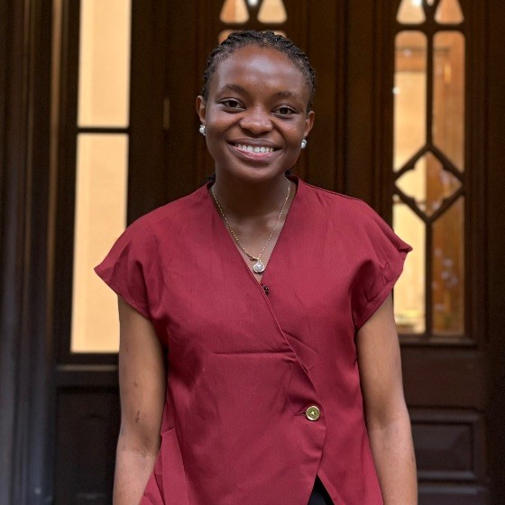

<div>
  
  <h1 style="margin-bottom: 0;">Carine Waguea Fongang</h1>
  <p style="margin-top: 6px; color: #666;">
    UPenn ’29 &nbsp;·&nbsp; Penn Engineering &nbsp;·&nbsp; Philadelphia, PA
  </p>
</div>

<p>
I’m a sophomore at Penn studying Computer Engineering — focused on embedded systems, edge AI, and ML hardware. My favorite coding language is C++, and I like figuring out why things are slow.
</p>

<p>
I’m an Open Dreams Scholar. I grew up in Cameroon, where I studied the sciences in high school. I spend a lot of my time teaching and mentoring others in STEM and working on projects with them, because other people did that for me.
</p>

> I’m not an AI advocate, but I do enjoy learning about it and understanding how it works.

---
### What I’m doing now

**Software Engineer (Fall) — JoyNet (Penn SAFELab)** <br>
<small>Sep 2026 – present</small><br>
JoyNet is a youth mental-health platform. I just started my role there and I’m currently doing a lot of frontend work.

**Website Support Associate — Netter Center for Community Partnerships** <br>
<small>April 2026 – present</small><br>
I keep three production sites running — Netter Center, Penn Leads the Vote, and University-Assisted Community Schools. They serve a network of ~300 universities and 1,200+ community partners. A lot of HTML/CSS, content updates, and fixing things quietly in the background.

Previously: **Research Assistant — Logsdon Lab, Penn Medicine** <small>(June – Aug 2026)</small> — built a Python/Bash pipeline to measure DNA repeat variation across 139 genome assemblies, and a Fourier-based tool called RepeatContact. I also did a lot of data analysis, mostly in Python. I worked on the computational side of things.

**Course Instructor — Fife-Penn STEM & CS Academy** <br>
<small>Jan 2026 – May 2026</small><br>
Taught Python, Scratch, and web dev to K-8 students in Philadelphia through Penn Engineering’s free after-school program.

---
### Things I’ve built

**<a href="https://github.com/wagueacarinetech-hue/File-Peek">FilePeek</a>** — C++, Windows API, Python, NVIDIA Nemotron <br>
<small>August 2026</small><br>
My file manager was full of files with names that told me nothing — `image1.jpg`, `final_v2.docx`, that kind of thing. I kept opening files one by one, or copying everything into an LLM to ask “what is this?”<br>
FilePeek sits in File Explorer and gives you a Quick Summary or Detailed Summary on hover, for 8 formats (pdf, docx, txt, md, csv, jpg/jpeg/png). Native C++ app + packaged Python backend, async so the UI doesn’t freeze, file-aware caching. Profiling it got cold-summary latency from 12.92s down to 9.22s (~28.6%).

**<a href="https://amgazal.github.io/Machine-Learning-project-22D/">AI Tweet Detection</a>** — Python, BERT, Logistic Regression, Streamlit <br>
<small>May 2026 – July 2026 · AI4ALL Ignite</small><br>
Can we tell human tweets from AI-generated ones? We trained models with Logistic Regression, Random Forest, and fine-tuned BERT. BERT got 92.1% accuracy, 0.930 F1. It was then deployed as a web app. This tool helps researchers tell AI-generated content apart from human writing.<br>

**Wonderly — HackMIT 2026** — Python, OpenCV <br>
<small>September 2026</small><br>
AI art-education prototype with a Reddit-style community for sharing artistic work. I worked on the computer vision side: image capture, continuous scanning, blur detection, duplicate-frame filtering, edge/contour extraction.

---
### Background

- **School:** University of Pennsylvania, B.S.E. Computer Engineering, expected May 2029
- **Coursework:** Data Structures & Algorithms, Programming Languages & Techniques I/II, Math Foundations of CS, Intro to Computer Systems
- **Programs:** Rachleff Scholar, AI4ALL Ignite Fellow, CodePath Technical Interview Prep, African Leadership Academy (Africanist Award)
- **Clubs:** Wharton Undergraduate Data Analytics Club, Rewriting the Code, CS Society, NSBE, ColorStack
- **Before Penn:** Open Dreams Scholar — tutoring, Aviva Initiative, community outreach. Jumpstart Academy Africa Scholar (I did a lot of robotics projects there)

Languages and tools I actually use:

<p>
  
  
  
  
  
  
  
  
  
</p>
<p>
  
  
  
  
  
  
  
  
</p>

---
### Contact

<p>
  <a href="mailto:fongang7@engineering.upenn.edu"></a>
  <a href="https://www.linkedin.com/in/fongangcarine"></a>
  <a href="https://github.com/wagueacarinetech-hue"></a>
</p>

<p>Always open to connecting — especially if you’re into embedded systems, edge AI, or CS / CMPE education.</p>

---
<details>
<summary><small>About this site / repo</small></summary>
<br>

This repo is my portfolio site. It’s Next.js 14 + React + TypeScript + Tailwind, with a 3D keyboard and GSAP/Framer Motion animations. Started from <a href="https://github.com/Naresh-Khatri/3d-portfolio">Naresh Khatri’s 3D portfolio</a> template and I’m making it mine.

```bash
# run it locally
pnpm install
pnpm dev
# → http://localhost:3000
```

Personal info lives in `src/data/config.ts`. Projects live in `src/data/projects.tsx`.

</details>
